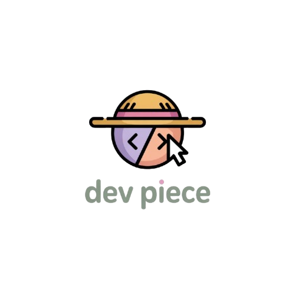

<div align="center">



<br/>


<br/>

<p>
  <strong>El hub definitivo de productividad para desarrolladores en español.</strong><br/>
  Herramientas CLI, configs, roadmaps interactivos, guías paso a paso y tu arsenal personal.<br/>
  Sin backend. Sin login. Sin tracking. Todo estático.
</p>

<br/>

[](https://astro.build)
[](https://react.dev)
[](https://www.typescriptlang.org)
[](https://tailwindcss.com)
[](https://pnpm.io)

[]()
[](https://catppuccin.com)
[]()
[](LICENSE)
[](https://nodejs.org)

<br/>

**[🌐 devpiece.vercel.app](https://devpiece.vercel.app)** &nbsp;·&nbsp; Creado por **[@mkcodev](https://github.com/mkcodev)**

</div>

---

## Contenidos

- [¿Qué es DevPiece?](#-qué-es-devpiece)
- [Features](#-features)
- [Stack Tecnológico](#-stack-tecnológico)
- [Estructura del Proyecto](#-estructura-del-proyecto)
- [Instalación y Desarrollo](#-instalación-y-desarrollo)
- [Categorías de Herramientas](#-categorías-de-herramientas)
- [Arsenal Power — Sistema de Ranks](#-arsenal-power--sistema-de-ranks)
- [Roadmaps](#-roadmaps)
- [Guías](#-guías)
- [Arquitectura Zero Backend](#-arquitectura-zero-backend)
- [Paleta Catppuccin Frappé](#-paleta-catppuccin-frappé)
- [Contribuir](#-contribuir)
- [Licencia](#-licencia)

---

## 🛠️ ¿Qué es DevPiece?

> **DevPiece** es un hub estático de productividad para desarrolladores — hecho por devs, para devs.
> Descubre herramientas, sigue roadmaps de aprendizaje, completa guías paso a paso y construye tu stack personal.
> Todo funciona offline. Sin servidor. Sin base de datos. Sin cookies.

DevPiece nació como **DevVault** y creció hasta convertirse en el arsenal dev más completo en español:
**112+ herramientas curadas** en **16 categorías**, **6 guías interactivas**, **5 roadmaps visuales**
y un sistema de gamificación que convierte tu stack en un rango — desde *Rookie Dev* hasta *Pirate King* 🏴‍☠️.

---

## ✨ Features

<div align="center">

| | Feature | Descripción |
|:---:|:---|:---|
| 🔧 | **Catálogo de Herramientas** | 112+ tools en 16 categorías con install commands, configs y tips |
| 🗺️ | **Roadmaps Interactivos** | 5 rutas de aprendizaje con nodos, edges y seguimiento de progreso |
| 📖 | **Guías Paso a Paso** | 6 guías con checkboxes, barra de progreso y acordeón de comandos |
| 🎒 | **Mi Arsenal** | Colección personal: Favoritos, Integraciones y Core Setup |
| ⚔️ | **Arsenal Power** | Gamificación con 6 ranks — de Rookie Dev a Pirate King |
| ⌘ | **Command Palette** | Búsqueda fuzzy instantánea con Ctrl+K / ⌘+K |
| ⇄ | **Botón Alternativa** | Marca qué tool usas en cada categoría y detecta tu stack activo |
| 🚫 | **Zero Backend** | Todo en `localStorage` — deployable en Vercel, Netlify, Cloudflare |
| 🎨 | **Dark Theme** | Catppuccin Frappé — paleta semántica por categoría de herramienta |
| 📤 | **Exportar Arsenal** | Genera un script `.sh` / `.ps1` para instalar todo tu stack de una |

</div>

<br/>

<details>
<summary><strong>🔧 Catálogo de Herramientas — detalle completo</strong></summary>
<br/>

Cada herramienta en DevPiece incluye:

- **Comandos de instalación** para `winget`, `scoop`, `choco`, `brew`, `apt`, `cargo`, `npm`, `pip`
- **Snippets de configuración** con syntax highlighting Catppuccin Frappé vía Shiki
- **Filtros por OS**: `Windows` · `macOS` · `Linux` · `Cross-platform`
- **Dificultad**: `Principiante` · `Intermedio` · `Avanzado`
- **Links** a repositorio, docs, web oficial y video tutorial

El contenido vive en archivos **MDX con frontmatter validado por Zod** — si el schema falla, el build falla. Cero datos corruptos en producción.

</details>

<details>
<summary><strong>🗺️ Roadmaps Interactivos — construidos con React Flow</strong></summary>
<br/>

Los roadmaps están construidos con **`@xyflow/react`**. Cada nodo incluye título, descripción, nivel de dificultad, fase y recursos externos. Haz clic para marcarlo como completado — el progreso persiste en `localStorage`.

| Roadmap | Tipo | Descripción |
|:---|:---:|:---|
| Frontend | Tech | HTML → CSS → JS → TS → React → Next.js → Deploy |
| Backend | Tech | Node.js → APIs REST → BD → Auth → Docker → Cloud |
| Full Stack | Tech | Ruta completa: Front + Back coordinados |
| Junior Setup | Tools | El entorno esencial para tu primer trabajo |
| Ninja Setup | Tools | Setup avanzado para productividad máxima |

</details>

<details>
<summary><strong>📖 Guías Paso a Paso — interactividad real sin backend</strong></summary>
<br/>

Cada guía tiene:
- ✅ **Checkboxes por paso** — marca tu progreso individualmente
- 📊 **Barra de progreso animada** — porcentaje completado en tiempo real
- ⚡ **Guía Rápida** — acordeón desplegable con solo los comandos
- ❤️ **Favoritos** — marca guías para acceso rápido desde Mi Arsenal
- 🏆 **+15 Arsenal Power** al completar una guía entera

Todo el estado se guarda en `localStorage` — sin servidor, sin pérdida de datos.

</details>

<details>
<summary><strong>🎒 Mi Arsenal — tu stack personal</strong></summary>
<br/>

El Arsenal tiene tres tabs:

| Tab | Descripción | Storage key |
|:---|:---|:---|
| **Favoritos** | Tools que te gustan o quieres explorar | `devpiece-favorites` |
| **Integraciones** | Tools que usas activamente en tu día a día | `devpiece-integrations` |
| **Core Setup** | Tools presentes en ambas listas — tu stack real | calculado en runtime |

Además puedes:
- **Exportar** tu arsenal como script `.sh` (bash/zsh) o `.ps1` (PowerShell)
- **Compartir** tu arsenal como URL con el stack codificado en base64
- **Crear Perfiles/Workspaces** (ej: "Frontend", "DevOps") y cambiar entre ellos
- **Reordenar** favoritos con drag & drop

</details>

---

## 🧰 Stack Tecnológico

<div align="center">

<table>
  <thead>
    <tr>
      <th>Capa</th>
      <th>Tecnología</th>
      <th>Para qué se usa</th>
    </tr>
  </thead>
  <tbody>
    <tr>
      <td><strong>Framework</strong></td>
      <td></td>
      <td>SSG, routing, islands architecture, MDX, Content Collections, sitemap</td>
    </tr>
    <tr>
      <td><strong>UI Interactiva</strong></td>
      <td></td>
      <td>Islands: CommandPalette, ArsenalPage, GuideIsland, RoadmapCanvas</td>
    </tr>
    <tr>
      <td><strong>Lenguaje</strong></td>
      <td></td>
      <td>Strict mode — Zod schemas validan el contenido MDX en build time</td>
    </tr>
    <tr>
      <td><strong>Estilos</strong></td>
      <td></td>
      <td>Catppuccin Frappé como paleta CSS nativa, utility-first, view transitions</td>
    </tr>
    <tr>
      <td><strong>Contenido</strong></td>
      <td></td>
      <td>118+ archivos MDX para herramientas y guías con frontmatter tipado</td>
    </tr>
    <tr>
      <td><strong>Búsqueda</strong></td>
      <td></td>
      <td>Fuzzy search sobre <code>/search-index.json</code> generado en build time</td>
    </tr>
    <tr>
      <td><strong>Roadmaps</strong></td>
      <td></td>
      <td>Grafos interactivos con nodos tipados, edges animados y pan/zoom</td>
    </tr>
    <tr>
      <td><strong>Validación</strong></td>
      <td></td>
      <td>Schemas para las 17 Content Collections — build falla si el frontmatter es inválido</td>
    </tr>
    <tr>
      <td><strong>Package Manager</strong></td>
      <td></td>
      <td>Requiere <code>Node ≥ 22.12.0</code></td>
    </tr>
    <tr>
      <td><strong>Output</strong></td>
      <td></td>
      <td>100% estático — Vercel, Netlify, Cloudflare Pages, GitHub Pages</td>
    </tr>
  </tbody>
</table>

</div>

---

## 📁 Estructura del Proyecto

```text
devpiece/
├── public/
│   ├── devpiece-logo.png          ← Logo oficial
│   ├── favicon.svg                ← Favicon personalizado
│   └── favicon.ico
│
├── src/
│   ├── components/
│   │   ├── arsenal/
│   │   │   ├── ArsenalPage.tsx    ← Mi Arsenal (tabs + ranks + export + share)
│   │   │   └── ArsenalBentoWidget.tsx
│   │   ├── guias/
│   │   │   └── GuideIsland.tsx    ← Guía interactiva (checkboxes + progreso + acordeón)
│   │   ├── roadmaps/
│   │   │   └── RoadmapCanvas.tsx  ← Canvas React Flow con nodos y edges
│   │   ├── search/
│   │   │   └── CommandPalette.tsx ← ⌘K fuzzy search (Fuse.js)
│   │   ├── tools/
│   │   │   └── ToolCard.astro     ← Card con install tabs y botones de arsenal
│   │   └── layout/
│   │       ├── Header.astro
│   │       ├── Sidebar.astro      ← Nav con pill animado y contadores por categoría
│   │       ├── MobileNav.astro
│   │       └── Footer.astro
│   │
│   ├── content/                   ← 112+ MDX files (Astro Content Collections)
│   │   ├── cli-tools/      (22)   ← bat, eza, fzf, lazygit, zoxide, atuin, mise...
│   │   ├── terminales/     (9)    ← Alacritty, WezTerm, Kitty, tmux, Starship...
│   │   ├── vscode/         (8)    ← GitLens, Error Lens, REST Client, Catppuccin...
│   │   ├── neovim/         (8)    ← lazy.nvim, LSP Zero, Telescope, Treesitter...
│   │   ├── browser-extensions/ (8)
│   │   ├── ai-tools/       (6)    ← Cursor, Continue, Copilot, Claude Code...
│   │   ├── git-hacks/      (6)    ← worktree, bisect, reflog, pre-commit, husky...
│   │   ├── learning/       (6)
│   │   ├── web-resources/  (6)
│   │   ├── windows-tools/  (7)
│   │   ├── snippets/       (7)
│   │   ├── dotfiles/       (4)
│   │   ├── docker/         (4)
│   │   ├── fonts/          (4)
│   │   ├── scripts-ahk/    (4)
│   │   ├── userscripts/    (3)
│   │   └── guias/          (6)    ← Guías interactivas con pasos y herramientas
│   │
│   ├── data/
│   │   └── roadmaps.ts            ← Los 5 roadmaps (nodos + edges + fases + dificultad)
│   │
│   ├── lib/
│   │   └── utils.ts               ← CATEGORY_CONFIG (16 categorías con accent colors)
│   │
│   ├── pages/
│   │   ├── index.astro            ← Home: hero, bento grid, featured tools
│   │   ├── [category]/index.astro ← Listado por categoría con filtros
│   │   ├── [category]/[slug].astro← Página individual de herramienta
│   │   ├── arsenal.astro          ← Mi Arsenal (/arsenal)
│   │   ├── roadmaps/              ← /roadmaps + /roadmaps/[slug]
│   │   ├── guias/                 ← /guias + /guias/[slug]
│   │   ├── search.astro
│   │   └── search-index.json.ts   ← Genera el índice de búsqueda en build time
│   │
│   ├── layouts/
│   │   └── BaseLayout.astro
│   │
│   ├── styles/
│   │   ├── globals.css            ← Variables Catppuccin Frappé + utilidades globales
│   │   └── transitions.css        ← Astro View Transitions
│   │
│   └── content.config.ts          ← Zod schemas para las 17 Content Collections
│
├── astro.config.mjs
├── tailwind.config.mjs
├── tsconfig.json
└── package.json
```

---

## 🚀 Instalación y Desarrollo

### Prerrequisitos

| Herramienta | Versión mínima |
|:---|:---:|
| <kbd>Node.js</kbd> | `≥ 22.12.0` |
| <kbd>pnpm</kbd> | `≥ 9.0.0` |

### Setup local

```bash
# 1. Clona el repositorio
git clone https://github.com/mkcodev/devpiece.git
cd devpiece

# 2. Instala dependencias
pnpm install

# 3. Servidor de desarrollo con hot reload
pnpm dev
# → http://localhost:4321

# 4. Build de producción estático
pnpm build

# 5. Preview del build antes de deployar
pnpm preview
```

### Deploy

DevPiece es **100% estático** (`output: 'static'`). El directorio de salida es `./dist`.

<div align="center">

| Plataforma | Build command | Publish dir |
|:---|:---|:---:|
| **Vercel** | `pnpm build` — preset Astro | `dist` |
| **Netlify** | `pnpm build` | `dist` |
| **Cloudflare Pages** | `pnpm build` | `dist` |
| **GitHub Pages** | `pnpm build` + acción oficial de Astro | `dist` |

</div>

---

## 🗂️ Categorías de Herramientas

<div align="center">

| Categoría | Tools | Acento | Ejemplos destacados |
|:---|:---:|:---:|:---|
| 🖥️ Terminales & Shells | 9 | `#8caaee` | Alacritty, WezTerm, Kitty, tmux, Starship |
| ⚡ CLI Tools | 22 | `#a6d189` | bat, eza, fzf, lazygit, zoxide, atuin, mise |
| 📝 Snippets & Aliases | 7 | `#ef9f76` | git-aliases, bash-functions, makefile-patterns |
| 🌿 Neovim | 8 | `#a6d189` | lazy.nvim, LSP Zero, Telescope, Treesitter |
| 💙 VS Code | 8 | `#8caaee` | GitLens, Error Lens, REST Client, Catppuccin |
| 🌐 Extensiones de Navegador | 8 | `#e5c890` | uBlock Origin, Vimium, Refined GitHub |
| ⌨️ AutoHotkey Scripts | 4 | `#ca9ee6` | CapsLock remap, window manager, text expander |
| 📜 UserScripts | 3 | `#81c8be` | GitHub Enhancer, YouTube Enhancer |
| ⚙️ Dotfiles & Configs | 4 | `#babbf1` | chezmoi, EditorConfig, direnv, gitconfig |
| 🐳 Docker Hacks | 4 | `#85c1dc` | lazydocker, dive, dockerfile patterns |
| 🌿 Git Power Moves | 6 | `#ef9f76` | git-worktree, bisect, reflog, pre-commit, husky |
| 🔤 Fuentes para Devs | 4 | `#f4b8e4` | JetBrains Mono, Fira Code, Cascadia Code, Nerd Fonts |
| 🤖 IA para Devs | 6 | `#babbf1` | Cursor, Continue, GitHub Copilot, Claude Code, Ollama |
| 🪟 Windows Power Tools | 7 | `#99d1db` | PowerToys, GlazeWM, Everything, ShareX |
| 📚 Aprendiendo | 6 | `#a6d189` | Exercism, Frontend Mentor, Fireship, The Odin Project |
| 🌍 Web Dev Resources | 6 | `#81c8be` | Excalidraw, Bundlephobia, MDN, regex101, DevDocs |

</div>

---

## ⚔️ Arsenal Power — Sistema de Ranks

El poder de tu arsenal se calcula a partir de cuántas herramientas tienes en **Favoritos** e **Integraciones** respecto al total del catálogo. Cada guía completada añade **+15 puntos de poder**.

<div align="center">

| Emoji | Rango | Power | Subtítulo |
|:---:|:---|:---:|:---|
| 🌱 | **Rookie Dev** | 0 – 7% | Tu viaje acaba de comenzar |
| ⚓ | **Junior Dev** | 8 – 19% | El Grand Line te llama |
| 🗺️ | **Mid Dev** | 20 – 39% | Tu arsenal toma forma |
| ⚔️ | **Senior Dev** | 40 – 64% | Dominas las herramientas |
| 🔱 | **10x Dev** | 65 – 84% | Productividad de élite |
| 💎 | **Pirate King 🏴‍☠️** | 85 – 100% | ¡Has encontrado el One Piece! |

</div>

> El sistema de ranks está inspirado en **One Piece** — porque construir un arsenal dev de élite es un viaje, no un destino.

---

## 🗺️ Roadmaps

Construidos con **React Flow** (`@xyflow/react`). Los nodos se marcan como completados, se visualizan por fases y se exploran con pan/zoom libre. El progreso persiste en `localStorage`.

```
   Frontend  ──────────┐
   Backend   ──────────┼──▶  Full Stack
                       │
   Junior Setup ───────┤
   Ninja Setup  ───────┘
```

Los roadmaps de **Tools** (*Junior Setup* y *Ninja Setup*) referencian herramientas del catálogo directamente — cada nodo lleva a la página de esa herramienta.

---

## 📖 Guías

Las guías son el corazón interactivo de DevPiece. Cada una tiene:

```
┌─────────────────────────────────────────────────────────────┐
│  📖 Terminal productiva en Windows             ████░  60%   │
├─────────────────────────────────────────────────────────────┤
│  ⚡ Guía Rápida  ▾                                          │
│     $ winget install Microsoft.WindowsTerminal              │
│     $ winget install Starship.Starship                      │
├─────────────────────────────────────────────────────────────┤
│  ✅ Paso 1 — Instalar Windows Terminal         completado   │
│  ✅ Paso 2 — Configurar perfil por defecto     completado   │
│  ◻  Paso 3 — Instalar Starship prompt          pendiente    │
│  ◻  Paso 4 — Fuente Nerd Font                  pendiente    │
└─────────────────────────────────────────────────────────────┘
```

<div align="center">

| Guía | OS | Dificultad | Tiempo estimado |
|:---|:---:|:---:|:---:|
| Terminal productiva en Windows | 🪟 | Principiante | 60 min |
| Terminal productiva en Linux/macOS | 🐧🍎 | Principiante | 45 min |
| VS Code desde cero | 🌐 | Principiante | 90 min |
| Git workflow pro | 🌐 | Intermedio | 75 min |
| Setup IA para devs | 🌐 | Intermedio | 60 min |
| Neovim desde cero | 🌐 | Avanzado | 120 min |

</div>

---

## 🏗️ Arquitectura Zero Backend

<details>
<summary><strong>Ver diagrama de flujo de datos</strong></summary>

<br/>

```
Usuario visita DevPiece
        │
        ├──▶  Carga página estática (HTML + CSS + JS pre-generado en build)
        │
        ├──▶  CommandPalette  ─── Ctrl+K ──────────────────────────────────▶
        │          └──▶  fetch('/search-index.json')    ← generado en build
        │                    └──▶  Fuse.js fuzzy search en cliente
        │
        ├──▶  Tool Card ─── "Añadir a Arsenal" ──────────────────────────────▶
        │          └──▶  localStorage['devpiece-favorites']
        │          └──▶  localStorage['devpiece-integrations']
        │          └──▶  localStorage['devpiece-alternatives']
        │
        ├──▶  GuideIsland ─── checkbox click ───────────────────────────────▶
        │          └──▶  localStorage['devpiece-guide-steps-{slug}']
        │          └──▶  localStorage['devpiece-guides-favorites']
        │
        └──▶  ArsenalPage ─── calcular Arsenal Power ───────────────────────▶
                   └──▶  (favoritos.length + integraciones.length) / totalTools × 100
                   └──▶  localStorage['devpiece-profiles']
```

**Sin servidor. Sin base de datos. Sin cookies. Sin analytics. Sin tracking.**

El único request externo es `fetch('/search-index.json')` — un archivo JSON estático generado en build time por `src/pages/search-index.json.ts` con todos los metadatos de herramientas y guías.

</details>

---

## 🎨 Paleta Catppuccin Frappé

<div align="center">


<br/>

Cada categoría tiene su propio color acento de la paleta Frappé:

| Categorías | Color | Hex |
|:---|:---:|:---|
| CLI Tools · Neovim · Aprendiendo | 🟢 Green | `#a6d189` |
| Terminales · VS Code | 🔵 Blue | `#8caaee` |
| Snippets · Git Power Moves | 🟠 Peach | `#ef9f76` |
| IA · Dotfiles | 🟣 Lavender | `#babbf1` |
| Docker | 🩵 Sapphire | `#85c1dc` |
| AutoHotkey | 💜 Mauve | `#ca9ee6` |
| Fuentes | 🩷 Pink | `#f4b8e4` |
| UserScripts · Web Resources | 🌊 Teal | `#81c8be` |
| Windows Tools | 🩶 Sky | `#99d1db` |
| Extensiones de Navegador | 💛 Yellow | `#e5c890` |

</div>

---

## 🤝 Contribuir

¡Las contribuciones son muy bienvenidas! DevPiece es un proyecto de la comunidad dev hispanohablante — hecho por devs, para devs.

### ¿Qué puedes aportar?

- 🔧 **Nueva herramienta** — crear un `.mdx` en la categoría correspondiente
- 📖 **Nueva guía** — con pasos, comandos y herramientas vinculadas
- 🗺️ **Nuevo roadmap** — nodos y edges en `src/data/roadmaps.ts`
- 🐛 **Bug fix** — abre un Issue o PR directamente
- ✏️ **Mejorar contenido** — corregir errores, actualizar versiones, añadir tips

### Añadir una nueva herramienta

```bash
# 1. Crea el archivo en la categoría correcta
touch src/content/cli-tools/mi-herramienta.mdx
```

**Frontmatter mínimo requerido** — validado por Zod en build time:

```yaml
---
name: "Mi Herramienta"
description: "Descripción corta (máx. 200 chars)"
category: cli-tools
tags: [cli, productivity]
os: [windows, macos, linux]
addedAt: 2026-01-01
difficulty: beginner   # beginner | intermediate | advanced
install:
  winget: winget install autor.herramienta
  brew:   brew install herramienta
links:
  repo: https://github.com/autor/herramienta
  docs: https://herramienta.dev
---

## ¿Qué es Mi Herramienta?

Descripción larga en Markdown...
```

> ⚠️ Si el frontmatter no pasa el schema de Zod, **`pnpm build` falla** con un error descriptivo. Esto garantiza que el contenido siempre sea correcto.

### Flujo de trabajo

```bash
# 1. Fork y clone
git clone https://github.com/TU_USUARIO/devpiece.git && cd devpiece

# 2. Instala dependencias
pnpm install

# 3. Crea tu rama
git checkout -b feat/nombre-herramienta

# 4. Desarrolla con hot reload
pnpm dev

# 5. Verifica que el build estático no rompe antes de hacer PR
pnpm build

# 6. Pull Request con descripción clara de qué añade y por qué
```

---

## 📄 Licencia

Distribuido bajo la licencia **MIT**. Ver [`LICENSE`](LICENSE) para más información.

---

<div align="center">

Hecho con ☕, demasiadas horas de terminal y mucho amor por **[@mkcodev](https://github.com/mkcodev)**

<sub>
DevPiece &nbsp;·&nbsp; Anteriormente DevVault &nbsp;·&nbsp;
Construido con <a href="https://astro.build">Astro</a> &nbsp;·&nbsp;
Theme <a href="https://catppuccin.com">Catppuccin Frappé</a> &nbsp;·&nbsp;
<a href="LICENSE">MIT License</a>
</sub>

<br/><br/>


</div>
